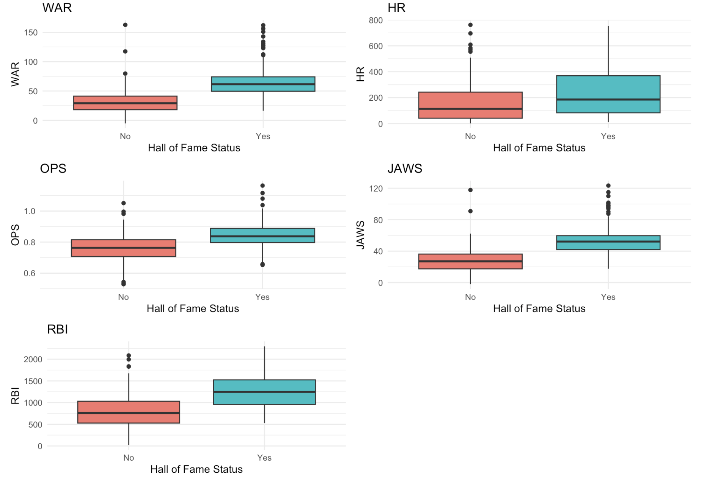
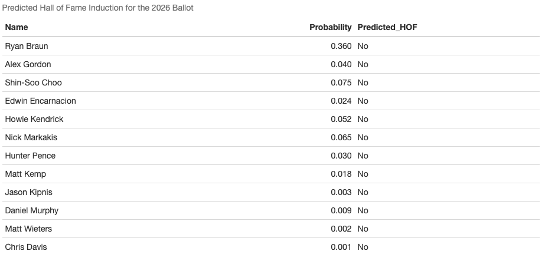

# Baseball Hall of Fame Prediction

This project develops a logistic regression model to predict Major League Baseball Hall of Fame induction using players' career performance statistics.

## Project Overview

The analysis includes:

- Exploratory data analysis 
- Data preparation
- Logistic regression model development
- Model evaluation using the Likelihood Ratio Test and Hosmer-Lemeshow Test
- Feature selection using backward, forward, and stepwise selection
- Prediction for the 2026 Hall of Fame ballot

  ## Results

- Developed a logistic regression model to predict Baseball Hall of Fame induction.
- Selected the final model using AIC-based feature selection (backward and stepwise selection).
- Achieved a classification accuracy of **89.29%** with the final model.
- Evaluated model performance using the Likelihood Ratio Test and Hosmer-Lemeshow Test.
- Predicted Hall of Fame induction probabilities for players on the 2026 Hall of Fame ballot.

## Example Visualization

The figure below compares selected career performance statistics for inducted and non-inducted players.

## Prediction Results

The final model was applied to the 2026 Hall of Fame ballot. Using a classification threshold of 0.50, none of the players were predicted to be inducted into the Hall of Fame.

## Files

- **hall_of_fame_analysis.Rmd** – R Markdown source code for the complete analysis.
- **hall_of_fame_analysis.html** – Rendered report containing the analysis, results, and visualizations.

## Tools

- R
- R Markdown
- tidyverse (dplyr, ggplot2)
- caret
- ResourceSelection

## Note

The datasets used in this project are not included because they were provided for educational purposes and may not be redistributed.
